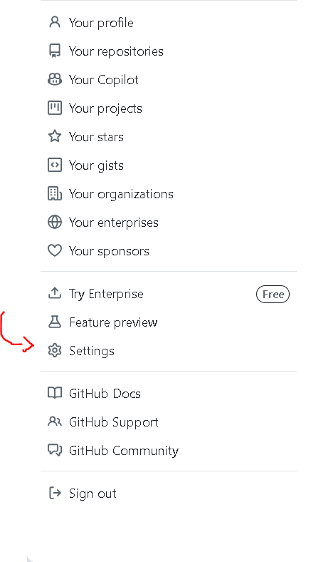
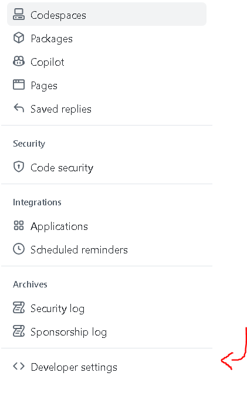
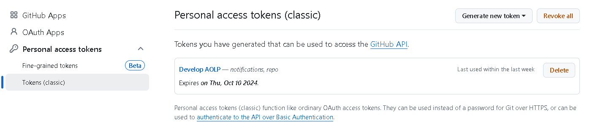
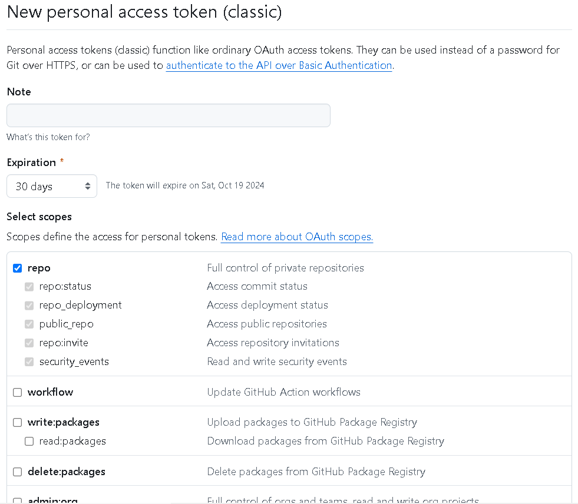

# Academy One Learning Platform (Em andamento)

## Instalação

Para instalar e inicializar o servidor local do projeto na sua máquina, siga os passos a seguir:

## Clone o repositório (Privado)

Para clonar um repositório privado no Github, você precisará gerar um **Token de Acesso Pessoal**.

### 1. Acesse as Configurações do Desenvolvedor
Em **Configurações**, vá para **Configurações do Desenvolvedor**:



<br>

### 2. Tokens de Acesso Pessoal
Em **Tokens de Acesso Pessoal**, selecione a opção Tokens(clássico) e gere uma nova chave:

<br>

### 3. Definindo Propósito e Escopo
Nessa página é onde você define o propósito de utilização do Token e os escopos de uso permitidos. Neste caso, você brevemente descreverá que o token será utilizado para "Gerenciar funcionalidades da Academy One" (ou semelhante) e como escopo, você selecionará a opção **repo**.

<br>

### 4. Importante
Certifique-se de copiar a chave na tela seguinte após a geração de chave pois você não terá outra chance


### 5. Clone o repositório

Com o Token de acesso, clone o repositório da seguinte maneira.

```
    git clone https://<username>:<token>@github.com/Academy-One/AOLP.git

    cd AOLP
```

## Instalando Dependências
Instale as dependências especificadas em requirements.txt:
```

pip install -r requirements.txt

```
<br>

Execute as migrações para criar as tabelas do banco de dados:

```
python manage.py migrate
```
<br>

Se você precisar acessar o admin do Django, crie um superusuário:
```
python manage.py createsuperuser
```
<br>

Inicialize o servidor de desenvolvimento:
```
python manage.py runserver
```
<br>
